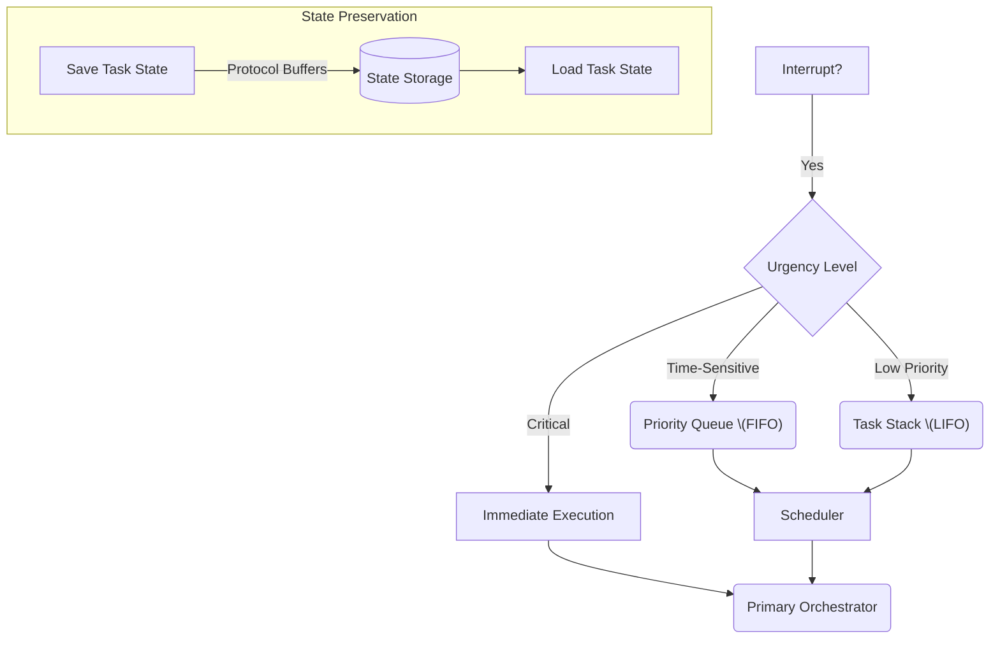

```mermaid
flowchart TD
    AA[Interrupt?] --> |Yes| BB{Urgency Level}
    BB --> |Critical| CC[Immediate Execution]
    CC --> DD(Primary Orchestrator)
    BB --> |Time-Sensitive| EE("Priority Queue \(FIFO)")
    BB --> |Low Priority | FF("Task Stack \(LIFO)")
    EE --> GG[Scheduler]
    FF --> GG[Scheduler]
    GG --> DD

    subgraph State Preservation
        SAVE[Save Task State] --> |Protocol Buffers| Storage[(State Storage)]
        Storage --> LOAD[Load Task State]
    end
```