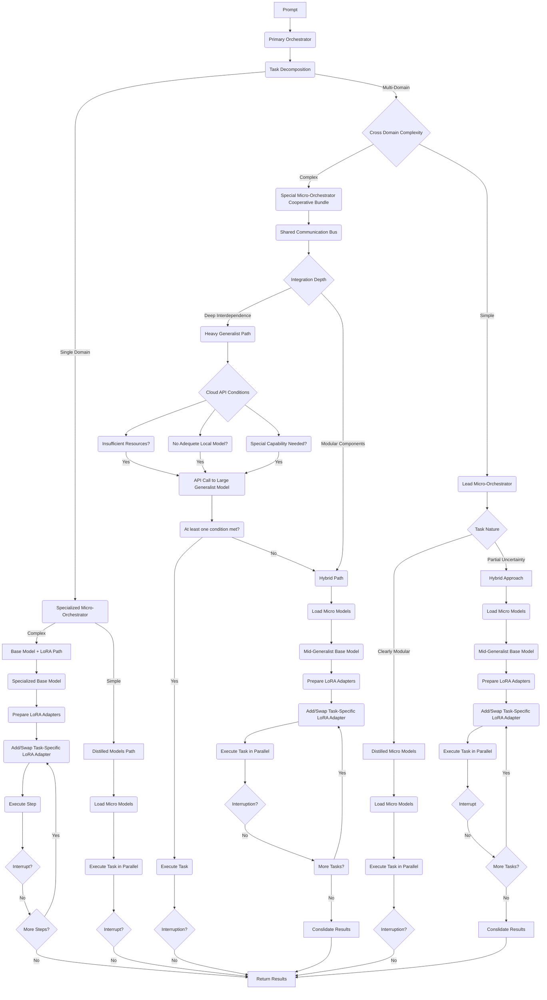

```mermaid
flowchart TD
    A[Prompt] --> A1(Primary Orchestrator)
    A1 --> A2(Task Decomposition)

    %% Single Domain Path
    A2 --> |Single Domain| B(Specialized Micro-Orchestrator)
    B --> |Complex| B_Complex[Base Model + LoRA Path]
    B --> |Simple| B_Simple[Distilled Models Path]

    B_Complex --> B01(Specialized Base Model)
    B01 --> B02(Prepare LoRA Adapters)
    B02 --> B03(Add/Swap Task-Specific LoRA Adapter)
    B03 --> B04(Execute Step)
    B04 --> B05{Interrupt?}
    B05 --> |No| B06{More Steps?}
    B06 --> |Yes| B03
    B06 --> |No| Return[Return Results]

    B_Simple --> B10(Load Micro Models)
    B10 --> B11(Execute Task in Parallel)
    B11 --> B12{Interrupt?}
    B12 --> |No| Return

    %% Multi Domain Path
    A2 --> |Multi-Domain| C{Cross Domain Complexity}
    C --> |Complex| D_Complex(Special Micro-Orchestrator Cooperative Bundle)
    C --> |Simple| D_Simple(Lead Micro-Orchestrator)
    
    D_Complex --> D01(Shared Communication Bus)
    D01 --> D02{Integration Depth}
    D02 --> |Deep Interdependence| D04(Heavy Generalist Path)
    D02 --> |Modular Components| D03(Hybrid Path)
    D04 --> D05{Cloud API Conditions}
    D05 --> D06(Insufficient Resources?)
    D05 --> D07(No Adequete Local Model?)
    D05 --> D08(Special Capability Needed?)
    D06 --> |Yes| D09(API Call to Large Generalist Model)
    D07 --> |Yes| D09
    D08 --> |Yes| D09
    D09 --> D090(At least one condition met?)
    D090 --> |Yes| D091(Execute Task)
    D090 --> |No| D03
    D091 --> D092{Interruption?}
    D092 --> |No| Return

    D03 --> D10(Load Micro Models)
    D10 --> D11(Mid-Generalist Base Model)
    D11 --> D12(Prepare LoRA Adapters)
    D12 --> D13(Add/Swap Task-Specific LoRA Adapter)
    D13 --> D14(Execute Task in Parallel)
    D14 --> D15{Interruption?}
    D15 --> |No| D16(More Tasks?)
    D16 --> |No| D17[Conslidate Results]
    D16 --> |Yes| D13
    D17 --> Return

    D_Simple --> D20{Task Nature}
    D20 --> |Clearly Modular| D21[Distilled Micro Models]
    D20 --> |Partial Uncertainty| D22[Hybrid Approach]
    D21 --> D23(Load Micro Models)
    D23 --> D24(Execute Task in Parallel)
    D24 --> D25{Interruption?}
    D25 --> |No| Return

    D22 --> D26(Load Micro Models)
    D26 --> D27(Mid-Generalist Base Model)
    D27 --> D28(Prepare LoRA Adapters)
    D28 --> D29(Add/Swap Task-Specific LoRA Adapter)
    D29 --> D290(Execute Task in Parallel)
    D290 --> D291{Interrupt}
    D291 --> |No| D292{More Tasks?}
    D292 --> |No| D293[Conslidate Results]
    D293 --> Return
    D292 --> |Yes| D29
```