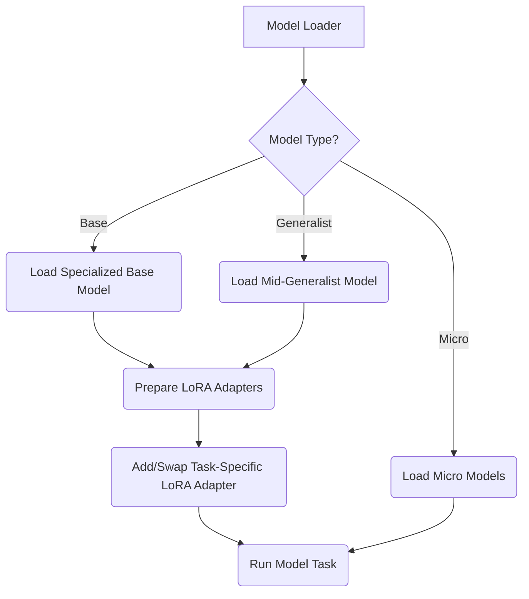

# Model + Adapter Handling Architecture

```mermaid
flowchart TD
    A[Model Loader] --> A1{Model Type?}
    A1 --> |Base| B1(Load Specialized Base Model)
    A1 --> |Micro| B2(Load Micro Models)
    A1 --> |Generalist| B3(Load Mid-Generalist Model)

    B1 --> C(Prepare LoRA Adapters)
    B3 --> C
    C --> D(Add/Swap Task-Specific LoRA Adapter)

    D --> E(Run Model Task)
    B2 --> E
```