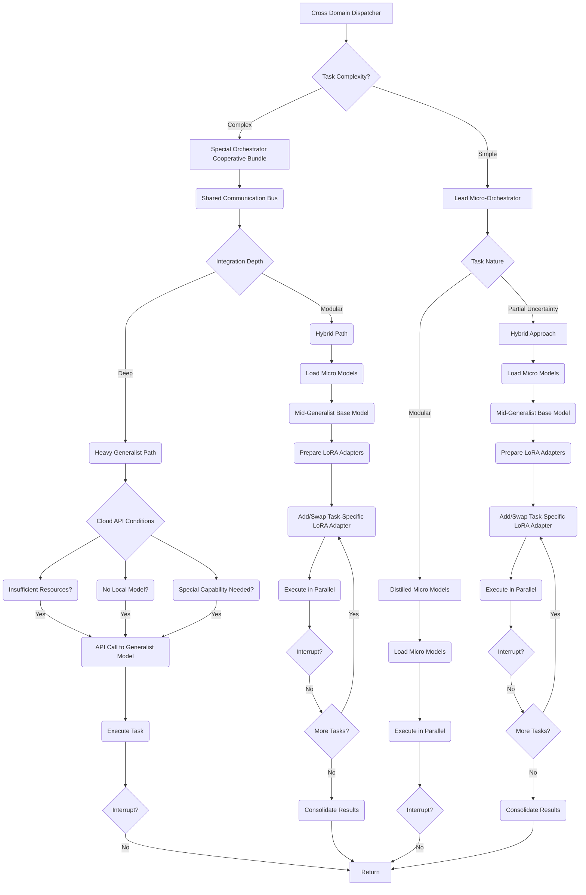

# Multi Domain Execution Architecture

```mermaid
flowchart TD
    A[Cross Domain Dispatcher] --> B{Task Complexity?}
    B --> |Complex| C[Special Orchestrator Cooperative Bundle]
    B --> |Simple| G[Lead Micro-Orchestrator]

    %% Complex path
    C --> C1(Shared Communication Bus)
    C1 --> C2{Integration Depth}
    C2 --> |Deep| C3(Heavy Generalist Path)
    C2 --> |Modular| C4(Hybrid Path)

    %% Generalist with API fallback
    C3 --> C5{Cloud API Conditions}
    C5 --> C6(Insufficient Resources?)
    C5 --> C7(No Local Model?)
    C5 --> C8(Special Capability Needed?)
    C6 --> |Yes| C9(API Call to Generalist Model)
    C7 --> |Yes| C9
    C8 --> |Yes| C9
    C9 --> C10(Execute Task)
    C10 --> C11{Interrupt?}
    C11 --> |No| Z1[Return]

    %% Hybrid path
    C4 --> C41(Load Micro Models)
    C41 --> C42(Mid-Generalist Base Model)
    C42 --> C43(Prepare LoRA Adapters)
    C43 --> C44(Add/Swap Task-Specific LoRA Adapter)
    C44 --> C45(Execute in Parallel)
    C45 --> C46{Interrupt?}
    C46 --> |No| C47{More Tasks?}
    C47 --> |Yes| C44
    C47 --> |No| C48(Consolidate Results)
    C48 --> Z1

    %% Simple path
    G --> G1{Task Nature}
    G1 --> |Modular| G2[Distilled Micro Models]
    G1 --> |Partial Uncertainty| G3[Hybrid Approach]

    G2 --> G21(Load Micro Models)
    G21 --> G22(Execute in Parallel)
    G22 --> G23{Interrupt?}
    G23 --> |No| Z1

    G3 --> G31(Load Micro Models)
    G31 --> G32(Mid-Generalist Base Model)
    G32 --> G33(Prepare LoRA Adapters)
    G33 --> G34(Add/Swap Task-Specific LoRA Adapter)
    G34 --> G35(Execute in Parallel)
    G35 --> G36{Interrupt?}
    G36 --> |No| G37{More Tasks?}
    G37 --> |Yes| G34
    G37 --> |No| G38(Consolidate Results)
    G38 --> Z1
```