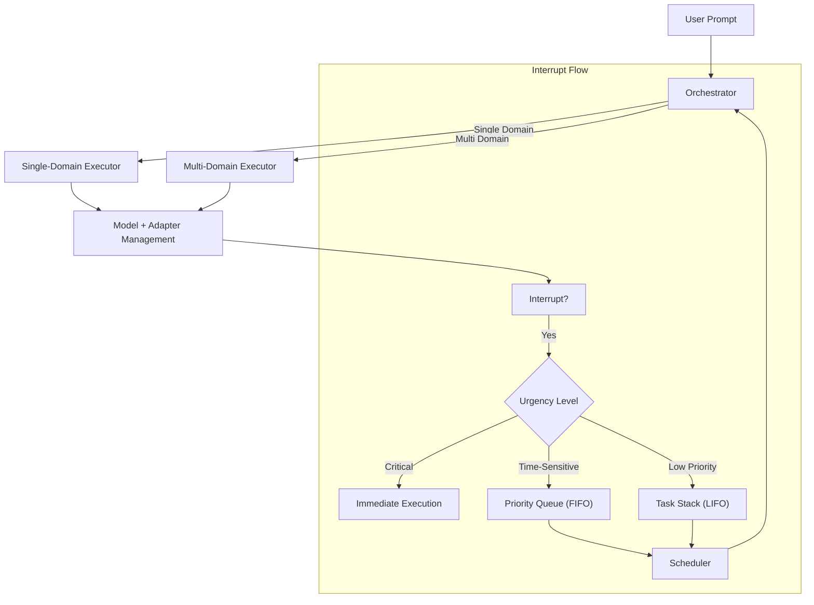

# High-Level Overview Diagram

```mermaid
flowchart TD
    A[User Prompt] --> B[Orchestrator]
    B --> |Single Domain| C[Single-Domain Executor]
    B --> |Multi Domain| D[Multi-Domain Executor]
    C --> E[Model + Adapter Management]
    D --> E

    %% Interruption Handling Highlight
    E --> F[Interrupt?]

    subgraph Interrupt Flow
        F --> |Yes| G{Urgency Level}
        G --> |Critical| H[Immediate Execution]
        G --> |Time-Sensitive| I["Priority Queue (FIFO)"]
        G --> |Low Priority| J["Task Stack (LIFO)"]
        I --> K[Scheduler]
        J --> K
        K --> B
    end
```