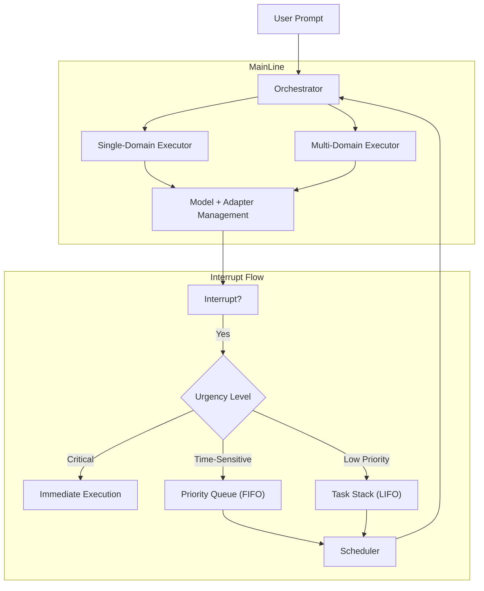

# High-Level Overview Diagram

```mermaid
flowchart TD
    %% Main flow
    A[User Prompt] --> B[Orchestrator]

    %% Invisible nodes for alignment
    subgraph MainLine
        direction LR
        B --> C[Single-Domain Executor]
        B --> D[Multi-Domain Executor]
        C --> E[Model + Adapter Management]
        D --> E
    end

    %% Interrupt check below Model Management
    E --> F[Interrupt?]

    %% Interrupt Flow starts here only
    subgraph Interrupt_Flow["Interrupt Flow"]
        direction TB
        F --> |Yes| G{Urgency Level}
        G --> |Critical| H[Immediate Execution]
        G --> |Time-Sensitive| I["Priority Queue (FIFO)"]
        G --> |Low Priority| J["Task Stack (LIFO)"]
        I --> K[Scheduler]
        J --> K
        K --> B
    end
```