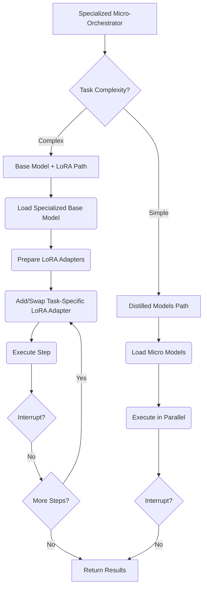

# Single Domain Execution Architecture

```mermaid
flowchart TD
    A[Specialized Micro-Orchestrator] --> B{Task Complexity?}
    B --> |Complex| C[Base Model + LoRA Path]
    B --> |Simple| D[Distilled Models Path]

    %% Complex path
    C --> C1(Load Specialized Base Model)
    C1 --> C2(Prepare LoRA Adapters)
    C2 --> C3(Add/Swap Task-Specific LoRA Adapter)
    C3 --> C4(Execute Step)
    C4 --> C5{Interrupt?}
    C5 --> |No| C6{More Steps?}
    C6 --> |Yes| C3
    C6 --> |No| Z1[Return Results]

    %% Simple path
    D --> D1(Load Micro Models)
    D1 --> D2(Execute in Parallel)
    D2 --> D3{Interrupt?}
    D3 --> |No| Z1
```