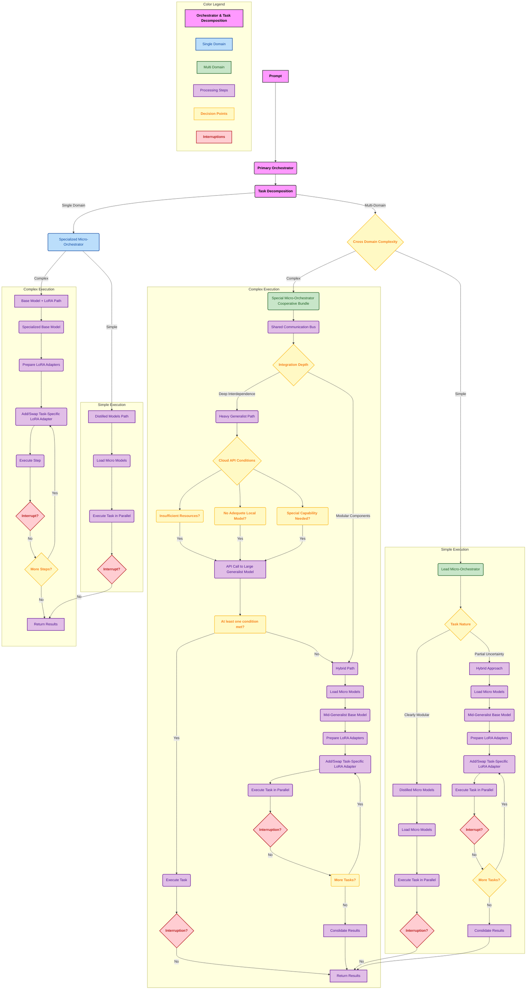

# Revamped Color-Coded Architecture Diagram

```mermaid
flowchart TD
    %% Define styles for color coding
    classDef orchestrator fill:#f9f,stroke:#333,stroke-width:2px,color:#000,font-weight:bold
    classDef singleDomain fill:#bbdefb,stroke:#0d47a1,stroke-width:2px,color:#0d47a1
    classDef multiDomain fill:#c8e6c9,stroke:#1b5e20,stroke-width:2px,color:#1b5e20
    classDef decision fill:#fff9c4,stroke:#fbc02d,stroke-width:2px,color:#f57f17,font-weight:bold
    classDef interrupt fill:#ffcdd2,stroke:#b71c1c,stroke-width:2px,color:#b71c1c,font-weight:bold
    classDef process fill:#e1bee7,stroke:#6a1b9a,stroke-width:2px,color:#4a148c

    %% Color Legend
    subgraph Legend["Color Legend"]
        direction LR
        L1[Orchestrator & Task Decomposition]:::orchestrator
        L2[Single Domain]:::singleDomain
        L3[Multi Domain]:::multiDomain
        L4[Processing Steps]:::process
        L5[Decision Points]:::decision
        L6[Interruptions]:::interrupt
    end

    %% Entry and Orchestration
    A[Prompt]:::orchestrator --> A1(Primary Orchestrator):::orchestrator
    A1 --> A2(Task Decomposition):::orchestrator

    %% Single Domain Path (placed higher)
    A2 --> |Single Domain| B(Specialized Micro-Orchestrator):::singleDomain
    
    B --> |Complex| B_Complex[Base Model + LoRA Path]:::process
    B --> |Simple| B_Simple[Distilled Models Path]:::process

    %% Complex Single Domain Execution
    subgraph SD_Complex [Complex Execution]
        direction TB
        B_Complex --> B01(Specialized Base Model):::process
        B01 --> B02(Prepare LoRA Adapters):::process
        B02 --> B03(Add/Swap Task-Specific LoRA Adapter):::process
        B03 --> B04(Execute Step):::process
        B04 --> B05{Interrupt?}:::interrupt
        B05 --> |No| B06{More Steps?}:::decision
        B06 --> |Yes| B03
        B06 --> |No| Return_SD[Return Results]:::process
    end

    %% Simple Single Domain Execution
    subgraph SD_Simple [Simple Execution]
        direction TB
        B_Simple --> B10(Load Micro Models):::process
        B10 --> B11(Execute Task in Parallel):::process
        B11 --> B12{Interrupt?}:::interrupt
        B12 --> |No| Return_SD
    end

    %% Multi Domain Path
    A2 --> |Multi-Domain| C{Cross Domain Complexity}:::decision

    C --> |Complex| D_Complex(Special Micro-Orchestrator Cooperative Bundle):::multiDomain
    C --> |Simple| D_Simple(Lead Micro-Orchestrator):::multiDomain
    
    %% Complex Multi Domain Execution
    subgraph MD_Complex [Complex Execution]
        direction TB
        D_Complex --> D01(Shared Communication Bus):::process
        D01 --> D02{Integration Depth}:::decision
        D02 --> |Deep Interdependence| D04(Heavy Generalist Path):::process
        D02 --> |Modular Components| D03(Hybrid Path):::process

        %% Heavy Generalist Path
        D04 --> D05{Cloud API Conditions}:::decision
        D05 --> D06(Insufficient Resources?):::decision
        D05 --> D07(No Adequete Local Model?):::decision
        D05 --> D08(Special Capability Needed?):::decision
        D06 --> |Yes| D09(API Call to Large Generalist Model):::process
        D07 --> |Yes| D09
        D08 --> |Yes| D09
        D09 --> D090(At least one condition met?):::decision
        D090 --> |Yes| D091(Execute Task):::process
        D090 --> |No| D03
        D091 --> D092{Interruption?}:::interrupt
        D092 --> |No| Return_MD[Return Results]:::process
        

        %% Hybrid Path
        D03 --> D10(Load Micro Models):::process
        D10 --> D11(Mid-Generalist Base Model):::process
        D11 --> D12(Prepare LoRA Adapters):::process
        D12 --> D13(Add/Swap Task-Specific LoRA Adapter):::process
        D13 --> D14(Execute Task in Parallel):::process
        D14 --> D15{Interruption?}:::interrupt
        D15 --> |No| D16(More Tasks?):::decision
        D16 --> |No| D17[Conslidate Results]:::process
        D16 --> |Yes| D13
        D17 --> Return_MD
    end

    %% Simple Multi Domain Execution
    subgraph MD_Simple [Simple Execution]
        direction TB
        D_Simple --> D20{Task Nature}:::decision
        D20 --> |Clearly Modular| D21[Distilled Micro Models]:::process
        D20 --> |Partial Uncertainty| D22[Hybrid Approach]:::process

        %% Clearly Modular path
        D21 --> D23(Load Micro Models):::process
        D23 --> D24(Execute Task in Parallel):::process
        D24 --> D25{Interruption?}:::interrupt
        D25 --> |No| Return_MD

        %% Partial Uncertainty path
        D22 --> D26(Load Micro Models):::process
        D26 --> D27(Mid-Generalist Base Model):::process
        D27 --> D28(Prepare LoRA Adapters):::process
        D28 --> D29(Add/Swap Task-Specific LoRA Adapter):::process
        D29 --> D290(Execute Task in Parallel):::process
        D290 --> D291{Interrupt?}:::interrupt
        D291 --> |No| D292{More Tasks?}:::decision
        D292 --> |No| D293[Conslidate Results]:::process
        D293 --> Return_MD
        D292 --> |Yes| D29
    end
```